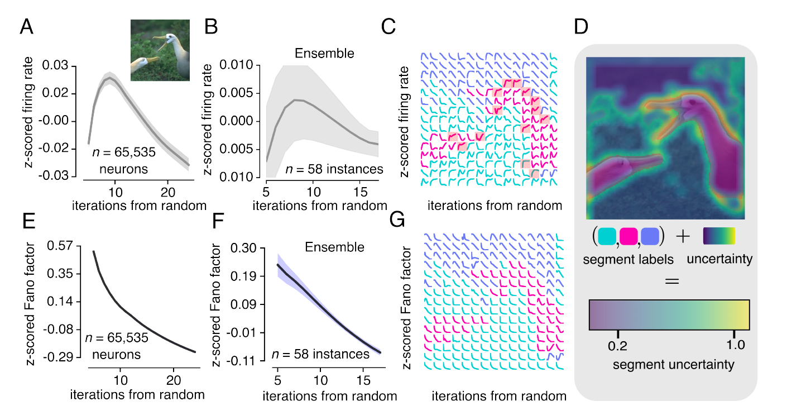
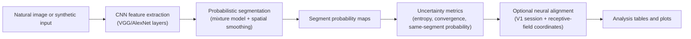

# SUN: Segmentation Uncertainty for Neural Dynamics

SUN is a computational vision neuroscience codebase for studying how uncertainty in natural-image segmentation can predict dynamics in early visual cortex (V1). The project connects a probabilistic image-segmentation model to neural-response analyses: image features are grouped into latent segments, segment probabilities evolve over iterative inference, and those uncertainty dynamics can be compared with firing-rate and variability measurements.

This public repository is designed to be readable without private lab data. The full research pipeline depends on internal neural recordings and BSDS-style image assets; the included demo is a lightweight smoke test that illustrates the expected output shapes on synthetic inputs.

## 30-second overview

- **Question:** Why do static natural images evoke time-varying firing rates and trial-to-trial variability in V1?
- **Model idea:** Visual segmentation is uncertain. A model repeatedly updates which pixels belong to which latent segment, producing probability maps and entropy maps over time.
- **Neural bridge:** Segmentation uncertainty and convergence metrics are aligned with neural receptive-field locations to test whether inferred image structure explains V1 dynamics.
- **Main outputs:** segmentation maps, per-pixel segment probabilities, entropy/uncertainty maps, pointwise convergence metrics, same-segment probabilities, neural-analysis tables, and figures.
- **Status:** research codebase. The public paper citation is not available yet; citation information will be added when public.

## Key result

The model produces V1-like response dynamics from segmentation uncertainty: firing-rate transients, spatially heterogeneous neural responses, variability decay measured by Fano factor, and high uncertainty near inferred segment boundaries.



## Pipeline



## Repository structure

| Path | Purpose |
| --- | --- |
| `src/SegmentationMap.py` | High-level image interface: load images, fit segmentation models, hold maps/probabilities. |
| `src/seg/` | Backend segmentation models, Gaussian/Student mixture priors, pyramid helpers, and model-fitting routines. |
| `src/dynamics.py` | Pointwise likelihood, convergence, same-segment probability, entropy, and reaction-time-style uncertainty metrics. |
| `src/Session.py` | Load and organize neural recording sessions and neuron coordinates. |
| `src/Analysis.py`, `src/analysis/` | Align segmentation maps with neural data and run single-neuron or pairwise analyses. |
| `src/import_utils.py` | Data loading utilities for BSDS-style image assets and lab session files. |
| `examples/demo_pipeline.py` | No-private-data smoke demo for external readers. |
| `docs/data.md` | Data availability, path configuration, and reproducibility notes. |
| `NOTICE.md` | Attribution and license/provenance notes for this collaborative research codebase. |

## Quickstart

### 1. Lightweight demo

This path does **not** require private neural data, BSDS assets, Torch, or pretrained model downloads.

```bash
python3 -m venv .venv
source .venv/bin/activate
pip install -r requirements-demo.txt
python examples/demo_pipeline.py --out outputs/demo
```

Expected output:

```text
SUN smoke demo complete
output_dir: outputs/demo
synthetic_image: (96, 96, 3)
probability_map: (3, 96, 96)
entropy_range: ...
```

The command writes:

- `outputs/demo/synthetic_image.npy`
- `outputs/demo/segment_probability_map.npy`
- `outputs/demo/entropy_map.npy`
- `outputs/demo/summary.json`
- `outputs/demo/demo_overview.png` when Matplotlib is installed

### 2. Full research environment

The full pipeline uses legacy scientific dependencies, including Torch/Torchvision for CNN feature extraction and local data paths for image/neural datasets.

```bash
python3 -m venv .venv
source .venv/bin/activate
pip install -r requirements.txt
export SUN_DATA_ROOT=/path/to/sun_workspace
export SUN_EXP_NAME=EXP150_NatImages_NeuroPixels
```

See [docs/data.md](docs/data.md) before running full experiments. The original data assets are not committed to this repository.

## Main modules

### Segmentation model

`src/seg/segment.py` and `src/seg/models_deep_seg.py` implement the core segmentation routines. The model extracts visual features from CNN layers, fits probabilistic segment assignments, and can retain iterative probability maps for downstream uncertainty analysis.

### Segmentation map wrapper

`src/SegmentationMap.py` wraps image loading, human segmentation labels when available, model fitting, cropping, and storage of segmentation outputs. Use this as the main object when working with a single image.

### Uncertainty dynamics

`src/dynamics.py` turns iterative segmentation outputs into interpretable dynamic metrics:

- pointwise likelihood over iterations
- convergence of segment probabilities
- same-segment probability between two coordinates
- entropy/uncertainty maps
- reaction-time-style proxies for convergence timing

### Neural alignment

`src/Session.py`, `src/Analysis.py`, and `src/analysis/` align segmentation-derived quantities with V1 recording sessions. They support single-neuron and pairwise analyses after private session data has been loaded locally.

## Expected outputs

Depending on the stage of the pipeline, outputs include:

- segmentation maps for each model/layer/component count
- per-pixel probability maps over latent segments
- entropy maps marking segmentation uncertainty
- convergence traces over iterative inference
- analysis DataFrames linking neural coordinates to segmentation metrics
- plots for receptive fields, uncertainty maps, and model/neural comparisons

Large generated artifacts should go under `outputs/` or another ignored local directory, not into git.

## Repository note

This repository keeps a collaborative lab codebase readable outside the original data environment. The public-facing changes focus on README context, a module map, data notes, a smoke demo, ignored generated files, and safer path configuration. Scientific ownership and third-party code provenance are preserved in the source headers and [NOTICE.md](NOTICE.md).

## Paper and citation

A public manuscript link is not available yet. Citation information will be added when available.

For now, if you reference this code, cite the repository and preserve the attribution notes in [NOTICE.md](NOTICE.md).
